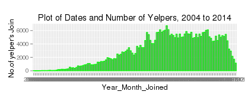
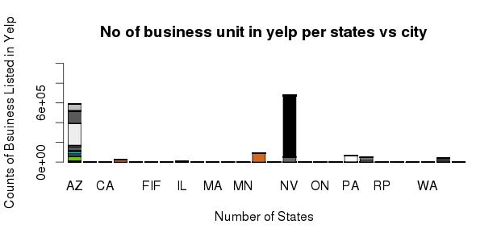

Capstone Project for Data Science Course
========================================================
Alok

20 Nov 2015

Analysis of Yelp Contributors' growth, reviews and rating behavior analysis 

Introduction and Problem Statement
=======================================================
The review [website Yelp] (http://www.yelp.com) not only connects customers with businesses but also allows customers to rate their experiences.[Yelp Dataset](https://d396qusza40orc.cloudfront.net/dsscapstone/dataset/yelp_dataset_challenge_academic_dataset.zip)

1. Is the yelper community growing?
2. In which states has large business entity listed in the yelper application?
3. Are there people who only give 1 star or 5-star reviews?
4. Is there a tendency for these persons to keep giving 1 star or 5 stars, or in other words, do they only write reviews to either complain or compliment about a business? Can this behavior be apparent by looking at the dataset?
5. Is it possible at all to reasonably predict what kind of rating a business will get based on the users rating behaviour?

 Method Used 
========================================================
1. Getting data set 
2. With jsonlite package using stream_in function load the json data 
3. Flatten json data 
4. Save data as .RData all 5 json Data files 
5. Identify the Keys relation between the data set 
6. Create the master data set for the Exploratory and detail data/modeling analysis.
As example 

business_dat <- stream_in(file("yelp_academic_dataset_business.json"))
f_business_dat <- flatten(business_dat, recursive = TRUE)
save(f_business_dat, file='business.RData')

Exploratory Data
=========================================================
Exploratory Data  Yelp Contributors' growth 

In which states has large business entity listed in the yelper app

Results 
========================================================
1. Growth in Yelp contributors to be small to negative in 2015

2. Yelp business entity major listed in AZ and NV state and Yelp business market need to focus to grow to business listing in other states like IL, WA, so user base of yelp will increase.
3. Users tendency to write stars 1 or 5
4. Users average stars rating between 3 to 4
5. Roughly 82% of predicted values are only off by +/- 1 star
   [Detail Analysis :DataScienceProjectr] (https://rpubs.com/alokd3/DataScienceProjectr)
